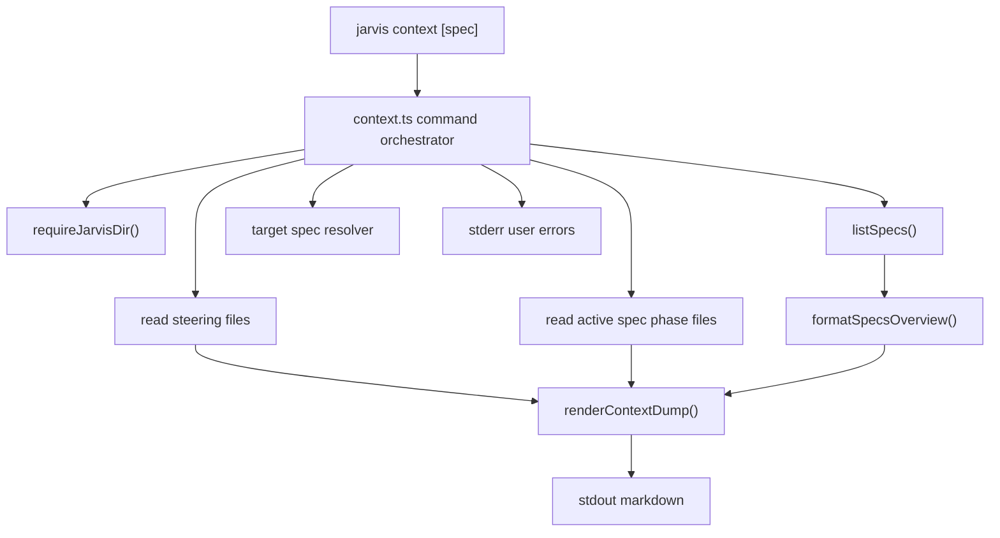

# Design: context-dump

## 1. Overview

`jarvis context [spec]` will become a read-only command that assembles a deterministic markdown document from existing `.jarvis/` files. The CLI command will orchestrate project discovery, target-spec resolution, file reads, error reporting, and stdout output; pure core helpers will format the shared specs overview and the final markdown dump. The design preserves Jarvis's existing boundaries: core formatting remains pure, filesystem access stays in `src/io/`, command files only orchestrate, and the command never calls a network service or LLM.

Addresses: US-001, US-002, US-003, FR-001, FR-002, FR-003, FR-004, NFR-001, NFR-002, NFR-003, NFR-004

## 2. Architecture

The feature fits into the existing CLI as a new implementation for the already-registered `context` command. It reuses `requireJarvisDir()` for project detection, `listSpecs()` and `readSpecState()` for spec state, and `readText()` / `pathExists()` for filesystem access. A new pure formatter will become the single source of truth for human spec overview rows, replacing the local row formatter currently embedded in `spec-status.ts`.



`spec-status.ts` will also import the shared overview formatter so the status command and context dump cannot drift in row format, marker meanings, or alphabetical assumptions. This keeps the `R✓ D· T-` / `?` marker behavior consistent for normal status output and for the embedded overview in the dump.

Addresses: US-001 (criteria 1, 2, 3, 6), US-002, US-003, FR-001, FR-002, FR-004, NFR-001, NFR-002, NFR-004

## 3. Components

### 3.1 Context command
- **Responsibility**: Implement `jarvis context [spec]` by locating the Jarvis project, resolving the target spec, reading the required files, invoking pure formatters, writing the final markdown to stdout, and returning Jarvis-compatible exit codes.
- **Inputs**: Optional `spec` argument from commander.
- **Outputs**: Exit code `0` on success; exit code `1` for expected user-facing errors; final dump on stdout only when successful; human-facing errors on stderr.
- **Location**: `src/cli/commands/context.ts`
- **Addresses**: US-001, US-002, US-003, FR-001, FR-002, FR-003, NFR-001, NFR-004

### 3.2 Specs overview formatter
- **Responsibility**: Format `SpecState[]` into deterministic human-readable overview lines with canonical phase markers: approved `✓`, draft `·`, missing `-`, malformed or unknown `?`.
- **Inputs**: `SpecState[]`.
- **Outputs**: A newline-delimited markdown-safe text block, with one line per spec.
- **Location**: `src/core/spec-format.ts`. This is a new file so persistence and state reading stay in `spec-store.ts` while formatting lives separately.
- **Addresses**: US-001 (criterion 6), FR-002, NFR-002

### 3.3 Context dump renderer
- **Responsibility**: Assemble the final markdown document from already-read content: agent instruction preface, `# Jarvis Context Dump`, steering sections, specs overview, and active spec sections.
- **Inputs**: Target spec name, steering file contents, specs overview text, and active phase file contents or missing placeholders.
- **Outputs**: A single markdown string.
- **Location**: `src/prompts/context-dump.ts`, matching the existing deterministic prompt-renderer convention.
- **Addresses**: US-001 (criteria 1, 2, 3, 4, 5, 7, 8, 9, 10), FR-001, FR-002, FR-003, FR-004, NFR-002, NFR-003

### 3.4 Target spec resolver
- **Responsibility**: Resolve the target spec name according to the MVP scope: explicit name wins; no name succeeds only when exactly one spec exists; no implicit active state is read.
- **Inputs**: Optional requested spec name, sorted `SpecState[]`.
- **Outputs**: Tagged result variant for resolved spec, no specs, multiple specs, or missing requested spec.
- **Location**: Private helper inside `src/cli/commands/context.ts`. It has only one caller, so it should stay local until another caller needs it.
- **Addresses**: US-001 (criterion 12), US-002, US-003 (criterion 2), NFR-002, NFR-004

### 3.5 File content reader orchestration
- **Responsibility**: Read complete steering files and active spec phase files. Missing steering is fatal; missing active phase files become placeholders; malformed front-matter never blocks raw inclusion.
- **Inputs**: Jarvis directory path and resolved spec name.
- **Outputs**: Steering contents or fatal error variant; phase contents with placeholders where files are absent.
- **Location**: `context.ts` orchestrates using `src/io/fs.ts` helpers. Any new low-level filesystem helper belongs in `src/io/fs.ts`.
- **Addresses**: US-001 (criteria 4, 9, 10, 11), US-003 (criteria 1, 3), FR-002, NFR-001, NFR-003, NFR-004

### 3.6 Spec status command formatter reuse
- **Responsibility**: Replace `spec-status.ts`'s command-local row formatter with the shared specs overview formatter while preserving existing status behavior.
- **Inputs**: `SpecState[]`.
- **Outputs**: Existing human status stdout rows.
- **Location**: `src/cli/commands/spec-status.ts`
- **Addresses**: US-001 (criterion 6), NFR-002

## 4. Data model

No persistent data model changes are required. The feature reads existing `.jarvis/` files and writes nothing.

Transient data shapes:

```ts
type ContextTargetResult =
  | { kind: 'resolved'; name: string }
  | { kind: 'no-specs' }
  | { kind: 'multiple-specs'; names: string[] }
  | { kind: 'spec-not-found'; requested: string; names: string[] };

interface ContextFile {
  filename: 'product.md' | 'tech.md' | 'structure.md' |
    'requirements.md' | 'design.md' | 'tasks.md';
  content: string;
}

interface ContextDumpInput {
  specName: string;
  steering: ContextFile[];
  specsOverview: string;
  activeSpec: ContextFile[];
}
```

`SpecState` and `SpecPhaseState` remain the source of truth for overview markers. `exists: false` maps to `-`; `status: 'approved'` maps to `✓`; `status: 'draft'` maps to `·`; any existing file with `status: null` maps to `?`, including malformed front-matter.

Addresses: US-001 (criteria 6, 10, 11), US-002, FR-002, FR-003, NFR-002, NFR-003

## 5. Contracts

### CLI contract

```text
jarvis context [spec]
```

- Success: exit `0`; stdout contains the complete markdown dump; stderr is empty on success. The command is machine-first (output consumed by an AI agent), so any stderr noise would contaminate piping use cases like `jarvis context login | pbcopy`.
- User-facing failure: exit `1`; stderr contains a clear error; stdout contains no partial dump.
- Unexpected failure: existing top-level handler returns exit `2`.

Addresses: US-001 (criterion 1), US-002, US-003, FR-001, NFR-004

### Dump format contract

```text
<agent instruction preface>

# Jarvis Context Dump

## Steering
### product.md
<raw content>

### tech.md
<raw content>

### structure.md
<raw content>

## Specs Overview
<shared spec overview rows>

## Active Spec: <name>
### requirements.md
<raw content or missing placeholder>

### design.md
<raw content or missing placeholder>

### tasks.md
<raw content or missing placeholder>
```

The agent instruction preface must instruct the AI agent to read the context, not act yet, summarize it in three bullets, and wait for further instructions. File contents are inserted raw; the renderer does not parse or rewrite included markdown.

Addresses: US-001 (criteria 2, 3, 4, 5, 7, 8, 9, 10, 11), FR-001, FR-002, FR-003, FR-004, NFR-003

### Pure formatter contracts

```ts
function formatSpecsOverview(states: readonly SpecState[]): string;

function renderContextDump(input: ContextDumpInput): string;

function resolveContextTarget(
  requested: string | undefined,
  states: readonly SpecState[],
): ContextTargetResult;
```

`formatSpecsOverview()` must be the only human row formatter used by both `spec-status.ts` and `context.ts`. `renderContextDump()` must not perform I/O, read process state, or inspect the filesystem. `resolveContextTarget()` must use only the provided states and requested name.

Addresses: US-001 (criteria 1, 6), US-002, FR-001, FR-002, NFR-001, NFR-002

## 6. Error handling

- **Not a Jarvis project**: Detected by `requireJarvisDir()`. The command uses the existing top-level `JarvisNotFoundError` path so stderr reports `not a Jarvis project, run \`jarvis init\`` and exit code is `1`. Addresses: US-003 (criterion 1), NFR-004.
- **Explicit spec does not exist**: Detected by comparing the requested name against `listSpecs()` results. The command returns exit `1` and lists available spec names. Addresses: US-001 (criterion 12), US-003 (criterion 2), NFR-004.
- **No spec name and zero specs**: Detected when `requested` is absent and `listSpecs()` returns an empty array. The command returns exit `1` with a hint to run `jarvis spec new`. Addresses: US-002 (criterion 2), US-003 (criterion 2), NFR-004.
- **No spec name and multiple specs**: Detected when `requested` is absent and `listSpecs()` returns more than one state. The command returns exit `1` and lists available spec names. Addresses: US-002 (criterion 3), US-003 (criterion 2), NFR-004.
- **Missing steering file**: Detected by checking each required steering path before reading. The command returns exit `1` with `steering file missing: <path>. Run \`jarvis init\` may be incomplete.` and no dump. Addresses: US-003 (criterion 2), FR-002, NFR-004.
- **Missing active spec phase file**: Detected by path existence or read failure classified as absent. The command inserts `<!-- phase file missing -->` in that phase section and continues. Addresses: US-001 (criterion 10), US-003 (criterion 3), NFR-003.
- **Malformed front-matter in any included file or overview source file**: Existing spec-state reading treats malformed phase front-matter as `status: null`; the overview formatter renders `?`. Active spec files are read as raw text and included unchanged. Addresses: US-001 (criterion 11), NFR-003.
- **Unexpected filesystem failure**: Permissions or other unexpected read failures bubble to the existing top-level unexpected error path unless deliberately classified as a missing active phase file. Addresses: NFR-004.

## 7. Security & privacy

The command is local-only and read-only. It does not authenticate, authorize, call external services, invoke an LLM, collect telemetry, or write project files. It intentionally excludes `.jarvis/config.json` and all non-selected spec bodies from the dump.

The selected spec name should be resolved against `listSpecs()` rather than used to read arbitrary paths directly. This preserves the existing spec-name constraints and prevents path traversal through the CLI argument.

Because stdout is the product, the command may expose whatever is already present in steering and the selected spec files. That is expected behavior for a paste-ready context command; users control these local files and choose where to paste the output.

Addresses: FR-003, NFR-001, NFR-003

## 8. Key decisions

### 8.1 Shared specs overview formatter
- **Decision**: Create a pure `formatSpecsOverview()` in `src/core/spec-format.ts` and make both `spec-status.ts` and `context.ts` use it.
- **Alternative considered**: Duplicate the row formatting logic in `context.ts`.
- **Rejected because**: Duplicating marker logic would let `jarvis spec status` and `jarvis context` drift, undermining the requirement that the dump use the same status marker style.
- **Addresses**: US-001 (criterion 6), NFR-002

### 8.2 Fatal missing steering files
- **Decision**: Treat missing `product.md`, `tech.md`, or `structure.md` as fatal with exit code `1`.
- **Alternative considered**: Insert placeholders for missing steering files, like missing phase files.
- **Rejected because**: Steering is the stable foundation of the context dump; without it, the dump is materially incomplete and less useful than an explicit repair signal.
- **Addresses**: US-003 (criterion 2), FR-002, NFR-004

### 8.3 Placeholder only for missing active phase files
- **Decision**: Insert `<!-- phase file missing -->` for missing `requirements.md`, `design.md`, or `tasks.md` in the selected spec.
- **Alternative considered**: Fail the command when any active phase file is missing.
- **Rejected because**: Spec phase files can reasonably be draft, empty, or absent during lifecycle work, and the requirements explicitly call for a placeholder.
- **Addresses**: US-001 (criteria 9, 10), US-003 (criterion 3), NFR-003

### 8.4 Raw inclusion over front-matter parsing for dump content
- **Decision**: Include active spec and steering file contents as raw text after successful reads.
- **Alternative considered**: Parse front-matter and reconstruct markdown sections from parsed data.
- **Rejected because**: Reconstructing would risk changing user-authored content and would fail on malformed front-matter even though the dump should be best-effort.
- **Addresses**: US-001 (criterion 11), NFR-003

### 8.5 Explicit or unambiguous spec selection only
- **Decision**: Resolve no-argument usage only when exactly one spec exists, and never read implicit active state.
- **Alternative considered**: Remember or infer an active spec from prior commands or recently modified files.
- **Rejected because**: Implicit active state is out of scope and would make behavior less predictable.
- **Addresses**: US-002, NFR-002

### 8.6 Pure renderer for final markdown
- **Decision**: Render the dump with a pure function that receives all content as input.
- **Alternative considered**: Build and print the dump incrementally inside `context.ts`.
- **Rejected because**: Incremental command-local printing makes deterministic output harder to snapshot test and risks partial stdout on later errors.
- **Addresses**: FR-001, FR-004, NFR-002, NFR-003

### 8.7 No new runtime dependency
- **Decision**: Use existing Node.js, core helpers, and current runtime dependencies only.
- **Alternative considered**: Add a markdown builder, table formatter, or filesystem utility dependency.
- **Rejected because**: The required formatting and reads are simple, and tech steering requires strong justification for every dependency.
- **Addresses**: NFR-001

## 9. Risks & mitigations

- **Risk**: Refactoring `spec-status.ts` to use the shared formatter could alter existing ANSI color behavior or spacing. -> **Mitigation**: Preserve current marker mapping and padding in `formatSpecsOverview()` and update existing status tests to assert unchanged output.
- **Risk**: Malformed front-matter in overview source files may obscure whether a phase is draft or approved. -> **Mitigation**: Render `?` for existing files with unknown status, matching the clarified status behavior.
- **Risk**: Building output in the command could emit partial dumps before a later fatal error is discovered. -> **Mitigation**: Read and validate all fatal inputs before calling `out()` with the final rendered string.
- **Risk**: Missing steering fatal behavior is stricter than missing phase behavior and could surprise users with partially initialized projects. -> **Mitigation**: Use a specific error message that names the missing path and points to incomplete `jarvis init`.
- **Risk**: Context dumps can include sensitive local project text from steering or the selected spec. -> **Mitigation**: Keep the command explicit, local-only, read-only, and scoped to the selected spec; exclude config and other spec bodies.
