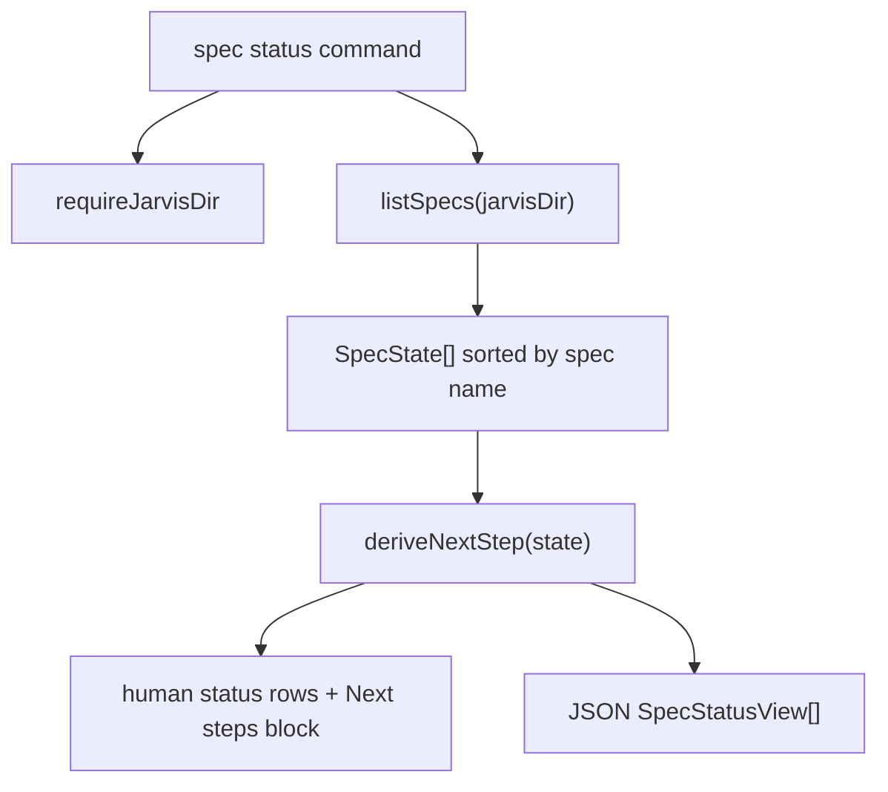

# Design: spec-status-next-step

<!--
This file answers HOW. Every decision must trace to one or more
user stories (US-XXX), functional requirements (FR-XXX), or
non-functional requirements (NFR-XXX) from requirements.md.
No full implementation code. Pseudocode and interface signatures are fine.
Respect tech.md constraints; flag conflicts instead of silently violating them.
-->

## 1. Overview

`jarvis spec status` will continue to read all spec states through the
existing spec-store API and render the existing human table unchanged.
The feature adds a pure next-step derivation layer that maps each
`SpecState` to either a concrete next-step object or `null`, then uses
that same object for both the human `Next steps:` block and the JSON
`nextStep` field. This keeps I/O at the command boundary, preserves the
current command surface, and guarantees identical action wording across
human and machine-readable output.

Addresses: US-001, US-002, FR-001, FR-002, FR-003, NFR-001, NFR-002, NFR-003

## 2. Architecture

The existing architecture already separates filesystem reads from CLI
rendering:



The command remains `jarvis spec status`; no new command or active-spec
state is introduced. `listSpecs` remains responsible for discovering all
specs and returning states sorted alphabetically. The new next-step
derivation is deterministic and side-effect free: it consumes the
already-read `SpecState` values and produces display-ready action text
plus structured metadata.

Human output keeps the current status table as the first stdout product.
After all rows are printed, the command prints `Next steps:` only when at
least one derived next step is non-null. JSON output changes from raw
spec states to status objects that include the same phase state fields
plus a `nextStep` field per spec.

Addresses: US-001, US-002, FR-001, FR-002, FR-003, NFR-001, NFR-002, NFR-003

## 3. Components

### 3.1 `spec-status` command orchestration
- **Responsibility**: Preserve the existing `jarvis spec status [--json]` command, obtain all spec states, select human or JSON rendering, and return the existing success exit code for informational status output.
- **Inputs**: CLI args containing the optional `json` flag; current Jarvis directory resolved by existing project discovery.
- **Outputs**: Existing human status table plus optional `Next steps:` block, or JSON status data with `nextStep` per spec.
- **Location**: `src/cli/commands/spec-status.ts`
- **Addresses**: US-001 (criteria 1, 3, 12, 13), US-002 (criterion 1), FR-001, FR-003, NFR-001

### 3.2 Next-step derivation
- **Responsibility**: Compute the single next step for a spec from its phase states using the required precedence: fully complete, missing file, malformed front-matter, normal flow.
- **Inputs**: One `SpecState`.
- **Outputs**: `NextStep | null`.
- **Location**: `src/core/spec-next-step.ts`
- **Addresses**: US-001 (criteria 2, 4, 5, 6, 7, 8, 9, 10, 11), US-002 (criteria 2, 3, 4, 5, 6, 7), FR-002, NFR-002, NFR-003

### 3.3 Human status rendering
- **Responsibility**: Keep existing row formatting unchanged, then render `Next steps:` lines for non-null next steps in the same order as the status table.
- **Inputs**: Sorted status view objects and the existing name padding width.
- **Outputs**: Status rows and, when applicable, a `Next steps:` block using the literal `→` glyph.
- **Location**: `src/cli/commands/spec-status.ts`
- **Addresses**: US-001 (criteria 1, 2, 3, 4, 6, 8, 12, 13), FR-001, FR-002, NFR-002, NFR-003

### 3.4 JSON status rendering
- **Responsibility**: Include `nextStep` in each JSON spec object while preserving the existing phase-state fields.
- **Inputs**: Sorted status view objects.
- **Outputs**: Pretty-printed JSON with `nextStep: null` for complete specs and a structured next-step object for incomplete or blocked specs.
- **Location**: `src/cli/commands/spec-status.ts`
- **Addresses**: US-002, FR-002, FR-003, NFR-002, NFR-003

### 3.5 Existing spec-store read model
- **Responsibility**: Continue reading `.jarvis/specs/<name>/` from disk and returning `SpecState[]` with `exists`, `status`, and `updated` per phase.
- **Inputs**: Jarvis directory path.
- **Outputs**: Alphabetically sorted `SpecState[]`.
- **Location**: `src/core/spec-store.ts`
- **Addresses**: US-001 (criteria 12, 13), FR-003, NFR-001, NFR-002

## 4. Data model

No persistent data model changes are required. The feature adds an
in-memory view model for status output.

### 4.1 `NextStep`

Interface sketch:

```ts
type NextStepKind = 'approve' | 'fix-malformed' | 'restore-missing';

interface NextStep {
  kind: NextStepKind;
  phase: SpecPhase;
  action: string;
}
```

Field constraints:

- `kind`: one of the three required values; never any other string.
- `phase`: the phase associated with the action.
- `action`: display-ready text used after the arrow in human output and
  as the JSON `nextStep.action` value.

Addresses: US-002 (criteria 3, 4, 5, 6, 7), NFR-003

### 4.2 Status view object

Interface sketch:

```ts
interface SpecStatusView extends SpecState {
  nextStep: NextStep | null;
}
```

The view extends the existing phase-state shape instead of replacing it,
so JSON consumers keep the current `name`, `requirements`, `design`, and
`tasks` fields and gain `nextStep`.

Addresses: US-002 (criteria 1, 2), FR-001, NFR-003

### 4.3 Canonical phases

The existing canonical phase order remains:

```ts
['requirements', 'design', 'tasks']
```

This order is used for completion checks, earliest missing phase,
earliest malformed phase, and normal-flow approval selection.

Addresses: US-001 (criteria 5, 7, 9, 10), US-002 (criteria 3, 4, 5), NFR-002

## 5. Contracts

### 5.1 Next-step derivation signature

Signature sketch:

```ts
function deriveNextStep(state: SpecState): NextStep | null
```

Contract:

- Returns `null` when all phases exist and are approved.
- Returns `restore-missing` for the earliest missing phase in canonical
  order before considering malformed or draft phases.
- Returns `fix-malformed` for the earliest phase with `exists: true` and
  `status: null` before considering normal draft approval.
- Returns `approve` for the earliest draft phase that represents the
  normal next approval step.
- Builds `action` once so all renderers consume identical text.

Addresses: US-001 (criteria 2, 4, 5, 6, 7, 8, 9, 10, 11), US-002 (criteria 2, 3, 4, 5, 6, 7), FR-002, NFR-002, NFR-003

### 5.2 Human output contract

For non-empty projects, human output keeps the existing rows first:

```text
<spec>  R<marker> D<marker> T<marker>
```

When at least one `nextStep` is non-null, the command appends:

```text
Next steps:
<spec>  → <nextStep.action>
```

The literal arrow is U+2192 and has no ASCII fallback. Lines are emitted
in the same alphabetical spec-name order already supplied by the status
table. Complete specs are skipped.

Addresses: US-001, FR-001, FR-002, FR-003, NFR-002, NFR-003

### 5.3 JSON output contract

JSON output is an array of status view objects:

```ts
Array<{
  name: string;
  requirements: SpecPhaseState;
  design: SpecPhaseState;
  tasks: SpecPhaseState;
  nextStep: NextStep | null;
}>
```

Example shape:

```json
{
  "name": "login",
  "requirements": { "exists": true, "status": "approved", "updated": "2026-05-11" },
  "design": { "exists": true, "status": "draft", "updated": "2026-05-11" },
  "tasks": { "exists": true, "status": "draft", "updated": "2026-05-11" },
  "nextStep": {
    "kind": "approve",
    "phase": "design",
    "action": "edit design.md, then run: jarvis spec approve login design"
  }
}
```

The JSON output remains stdout-only, including the empty-project case.

Addresses: US-002, FR-002, FR-003, NFR-002, NFR-003

### 5.4 Exit code contract

The command remains informational. Successful human and JSON status
queries return exit code `0`, including empty projects, complete specs,
missing phase files, and malformed front-matter reports.

Addresses: US-001 (criteria 6, 8, 12), US-002, FR-001

## 6. Error handling

Expected spec-state anomalies are surfaced as next-step guidance, not
thrown exceptions.

- **Empty project**: `listSpecs` returns an empty array. Human output keeps the existing no-specs-yet message and does not print `Next steps:`. JSON output remains `[]`. Addresses: US-001 (criterion 12), US-002 (criterion 1), FR-001.
- **Fully complete spec**: all three phases exist and have `approved` status. `deriveNextStep` returns `null`; human output omits the spec from `Next steps:` and JSON emits `nextStep: null`. Addresses: US-001 (criteria 2, 3), US-002 (criterion 2), FR-002.
- **Missing phase file**: a phase has `exists: false`. The earliest missing phase in canonical order becomes `restore-missing`, and no approval command is suggested. Addresses: US-001 (criteria 6, 7, 10, 11), US-002 (criterion 4).
- **Malformed or unreadable front-matter**: a phase has `exists: true` and `status: null`. The earliest affected phase in canonical order becomes `fix-malformed`, and no approval command is suggested. Addresses: US-001 (criteria 8, 9, 10, 11), US-002 (criterion 5).
- **Normal draft flow**: after complete, missing, and malformed checks, the earliest draft phase becomes `approve`. Addresses: US-001 (criteria 4, 5, 10), US-002 (criterion 3).
- **Unexpected filesystem or process failure**: existing command-level behavior applies. These are not converted into next steps because they are not spec lifecycle states. Addresses: NFR-001, FR-001.

## 7. Security & privacy

No authentication, authorization, audit logging, or sensitive-data
handling changes are required. The feature reads the same local
`.jarvis/` files already used by `jarvis spec status` and does not
write files, call network services, invoke an LLM, or add telemetry.

The only new data emitted is derived from local spec names and phase
states already visible in the existing status output.

Addresses: NFR-001, FR-001

## 8. Key decisions

### 8.1 Keep this as `spec status`
- **Decision**: Enhance the existing `jarvis spec status` command.
- **Alternative considered**: Add a separate next-step command.
- **Rejected because**: A new command would increase CLI surface area and split information that belongs with status.
- **Addresses**: US-001, US-002, FR-001, FR-003

### 8.2 Derive next steps from `SpecState`
- **Decision**: Compute next steps from the existing `SpecState` read model.
- **Alternative considered**: Re-read files or parse markdown inside the command renderer.
- **Rejected because**: Re-reading would duplicate I/O, weaken the pure-core boundary, and risk inconsistencies between markers and next-step decisions.
- **Addresses**: US-001, US-002, NFR-001, NFR-002

### 8.3 Single source for action text
- **Decision**: Build the `action` string in the next-step derivation result and reuse it in human and JSON output.
- **Alternative considered**: Render action text separately in human and JSON paths.
- **Rejected because**: Separate renderers could drift and violate the required text parity.
- **Addresses**: US-001 (criteria 4, 6, 8), US-002 (criteria 3, 4, 5), NFR-003

### 8.4 Literal U+2192 arrow
- **Decision**: Human output uses the literal `→` glyph in `Next steps:` lines, with no ASCII fallback.
- **Alternative considered**: Use `->` or switch dynamically based on terminal capabilities.
- **Rejected because**: Jarvis already emits UTF-8 markers, JSON is UTF-8, and runtime fallback logic would add complexity without meaningful value.
- **Addresses**: US-001 (criteria 4, 6, 8), NFR-002, NFR-003

### 8.5 Precedence before normal flow
- **Decision**: Apply the required precedence before selecting an approvable draft phase: complete, missing, malformed, normal flow.
- **Alternative considered**: Select the first draft phase first and report anomalies only when they block that phase.
- **Rejected because**: Missing files and malformed front-matter require manual repair and must not be hidden behind an approval command.
- **Addresses**: US-001 (criteria 6, 8, 10, 11), US-002 (criteria 4, 5)

### 8.6 Preserve alphabetical ordering
- **Decision**: Use the existing `listSpecs` alphabetical order for both status rows and next-step lines.
- **Alternative considered**: Sort next-step lines independently after filtering.
- **Rejected because**: Independent sorting is redundant and can drift from the status table order if collation changes.
- **Addresses**: US-001 (criterion 13), FR-003, NFR-002

### 8.7 JSON view extends existing shape
- **Decision**: JSON status objects retain existing phase fields and add `nextStep`.
- **Alternative considered**: Emit a separate top-level `nextSteps` array.
- **Rejected because**: Per-spec `nextStep` is the approved contract and is easier for CI to filter without joining by name.
- **Addresses**: US-002, FR-002, FR-003

### 8.8 Put derivation in a pure core module
- **Decision**: Add `src/core/spec-next-step.ts` for next-step derivation.
- **Alternative considered**: Keep derivation inside `src/cli/commands/spec-status.ts` or fold it into `src/core/spec-store.ts`.
- **Rejected because**: The command should orchestrate rather than contain domain logic, and spec-store should remain focused on reading and mutating spec files.
- **Addresses**: US-001, US-002, NFR-001, NFR-002

## 9. Risks & mitigations

- **Risk**: Existing JSON consumers may expect raw `SpecState[]` without extra fields. → **Mitigation**: Add `nextStep` as an additive per-object field while preserving existing fields; document the shape in tests and release notes. Addresses: US-002, FR-001.
- **Risk**: Current `SpecPhaseState` uses `exists: true` and `status: null` for both unreadable files and malformed front-matter, so the user-facing message will group both as front-matter repair. → **Mitigation**: Treat both as the approved `fix-malformed` next-step kind because the requirement describes unreadable status/front-matter as manual intervention. Addresses: US-001 (criterion 8), US-002 (criterion 5).
- **Risk**: Action wording can drift if future changes update human rendering but not JSON. → **Mitigation**: Keep action text in `NextStep.action` and assert exact parity in tests. Addresses: NFR-003.
- **Risk**: Terminal or file viewers with the wrong encoding may display `→` incorrectly. → **Mitigation**: No runtime fallback; Jarvis already relies on UTF-8 output and Node 20+ emits UTF-8 strings consistently. Addresses: NFR-002, NFR-003.
- **Risk**: Both this spec and `context-dump` modify `src/cli/commands/spec-status.ts`: this spec adds the `Next steps:` block and the `nextStep` JSON field; context-dump T-002 refactors row formatting to use the shared `formatSpecsOverview()`. Implementing both without coordination creates trivial but avoidable conflicts. → **Mitigation**: Implement this spec first. context-dump then consumes the stabilized `spec-status.ts` and only refactors existing row formatting, not the `Next steps:` block added by this spec. The reverse order is viable but requires re-reading spec-status output during context-dump implementation. Addresses: FR-001.
